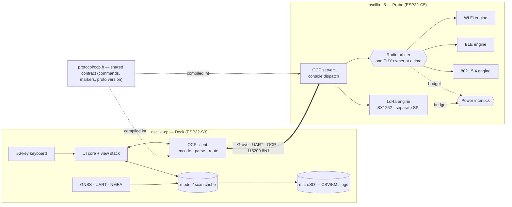

# Oscilla — Master Design Document

> A two-part wireless-recon instrument: a **Cardputer ADV** deck driving an **ESP32-C5 + SX1262** radio backpack.
> Trace the spectrum. Inspect, don't intrude.

| | |
|---|---|
| **Status** | Draft v0.2 — reconciled against backpack hardware Rev D |
| **Organization** | **d3FRAG Networks** |
| **Targets** | `oscilla-cp` (M5Stack Cardputer ADV / ESP32-S3) · `oscilla-c5` (Seeed XIAO ESP32-C5) |
| **Posture** | **Receive-only on every radio.** No transmit verb is compiled into any build — active/offensive features are structurally unreachable, not merely unused. See [§8](#8-feature-scope--the-receive-only-boundary) |
| **Hardware authority** | [`Research/c5-backpack-design.md`](Research/c5-backpack-design.md) Rev D — pin maps, electrical limits, bring-up order |
| **Tracking** | [`ROADMAP.md`](ROADMAP.md) · [`WORKLOG.md`](WORKLOG.md) · [`docs/DECISIONS.md`](docs/DECISIONS.md) |
| **Lineage** | Architecture & C5 recon patterns studied from C5Lab *projectZero* (MIT) and `@risinek` *esp32-wifi-penetration-tool* (MIT) |

> **Document precedence.** Where this document and `Research/c5-backpack-design.md` disagree about *hardware* — pins, rails, bus sharing, component ownership — **Rev D wins** and this document is wrong. Where they disagree about *software architecture* — protocol, module structure, feature scope — this document wins. Fix the loser on purpose.

---

## 0. Table of contents

1. [Vision & scope](#1-vision--scope)
2. [The core architectural decision: two targets, one contract](#2-the-core-architectural-decision-two-targets-one-contract)
3. [System overview](#3-system-overview)
4. [Hardware](#4-hardware)
5. [Oscilla Control Protocol (OCP) — the contract](#5-oscilla-control-protocol-ocp--the-contract)
6. [`oscilla-c5` — the probe firmware](#6-oscilla-c5--the-probe-firmware)
7. [`oscilla-cp` — the deck firmware](#7-oscilla-cp--the-deck-firmware)
8. [Feature scope & the receive-only boundary](#8-feature-scope--the-receive-only-boundary)
9. [Data model & on-device formats](#9-data-model--on-device-formats)
10. [Repository layout & build](#10-repository-layout--build)
11. [Reuse plan & licensing](#11-reuse-plan--licensing)
12. [Roadmap](#12-roadmap)
13. [Open decisions](#13-open-decisions)
14. [Appendix A — command catalog](#appendix-a--command-catalog)
15. [Appendix B — marker registry](#appendix-b--marker-registry)

---

## 1. Vision & scope

**Oscilla is a handheld wireless-recon instrument.** You carry a Cardputer ADV; it drives a dedicated ESP32-C5 radio backpack over a short Grove UART link. The Cardputer is the *deck* — keyboard, displays, GNSS, storage, menus, saved data. The C5 is the *probe* — it owns the radios and does all the RF. Together they scan, inspect, and map Wi-Fi (2.4 + 5 GHz), Bluetooth LE, 802.15.4 (Zigbee/Thread), and sub-GHz LoRa environments.

The name is the frame: an **oscilloscope for the air**. The product's job is to make invisible RF *legible* — what's transmitting, on which channel, how strong, how secured — not to interfere with it. **Every radio is receive-only.** No transmit verb is compiled into any build, so there is no reachable firmware path to transmission on any radio ([§8](#8-feature-scope--the-receive-only-boundary)).

**In scope (v1):**
- Passive Wi-Fi survey: scan, per-AP inspection (security posture, uptime), client/probe sniffing, channel-utilization views.
- BLE survey: device enumeration, RSSI tracking, tracker (AirTag/SmartTag) detection.
- 802.15.4 survey: passive PAN/node discovery, protocol classification.
- **LoRa survey (RX)**: sub-GHz listening — packet observation, RSSI/SNR, Meshtastic/LoRaWAN framing classification.
- Geolocated logging (wardrive-style) to the **deck's** microSD in standard formats, using the deck's own GNSS fix.
- A clean, discoverable UI across the internal 240×135 LCD and, when fitted, an external 240×320 panel.

**Explicitly out of scope (v1):** deauth, evil-twin, rogue AP, beacon spam, SAE overflow, jamming, on-LAN attacks, LoRa transmission, and any transmission whatsoever on any radio. See [§8](#8-feature-scope--the-receive-only-boundary) for why the architecture makes these *unreachable* rather than merely *unused*.

**Non-goals:** Oscilla is not a general M5Stack launcher, not a Flipper replacement, not a packet-injection platform. It does one category of thing well.

> **Authorized use.** Oscilla receives; it is designed for surveying spectrum you are permitted to survey (your own networks, authorized assessments, education). Passive reception has its own legal contours by jurisdiction — know yours.

---

## 2. The core architectural decision: two targets, one contract

It's tempting to think of "the Oscilla firmware" as one thing. It can't be a single binary: the Cardputer ADV is an **ESP32-S3** (Xtensa, 2.4 GHz Wi-Fi + BLE only) and the probe is an **ESP32-C5** (RISC-V, dual-band Wi-Fi + BLE + 802.15.4, plus an SX1262 on its own SPI bus). Different ISA, different radios, different job.

What Oscilla *is*, precisely:

- **One repository** (monorepo) holding two firmware apps plus shared code.
- **One protocol contract** — the Oscilla Control Protocol ([§5](#5-oscilla-control-protocol-ocp--the-contract)) — defined once in a shared header that both apps compile against, so command names and reply markers can never drift between deck and probe.
- **One design language** — shared conventions for framing, errors, versioning, config.



**Why this split is the right one:**
- The probe exposes **no radio API** to the deck — only vetted OCP verbs, all of them receive-only. The deck literally cannot misuse the radio; it can only ask for surveys. The command table *is* the capability surface, and with no transmit verb compiled into it, the receive-only boundary is a build-time fact, not a runtime toggle ([§8](#8-feature-scope--the-receive-only-boundary)). That is the security boundary and it's free.
- The deck can be reflashed/iterated (UI churn is frequent) without touching probe firmware, and vice-versa.
- The probe is independently useful and testable from any serial terminal — the deck is "just" a nice OCP client.
- A future second deck (phone app, web-serial page, Flipper) is a new OCP client, not a rewrite.
- **The deck stays useful with the backpack absent.** GNSS, storage, displays and offline review are all deck-local (Rev D §10).

---

## 3. System overview

| Layer | Deck (`oscilla-cp`) | Probe (`oscilla-c5`) |
|---|---|---|
| **Role** | Human interface, GNSS, storage, orchestration, review | RF acquisition, parsing, streaming |
| **Owns** | Keyboard, internal LCD, external TFT, microSD, **GNSS**, battery/UI | Survey radios (Wi-Fi/BLE/802.15.4), **SX1262 LoRa** |
| **Radios** | Its 2.4 GHz Wi-Fi/BLE stay **off** in v1 (reserved for future OTA) | Wi-Fi 2.4+5 GHz, BLE, 802.15.4, LoRa 862–930 MHz — **all receive-only** |
| **Storage** | All logs and captures land here | NVS config only — **no microSD on the probe** |
| **Talks** | OCP client (sends verbs, parses frames, handles async events) | OCP server (console dispatch, emits frames + events) |
| **Language** | Arduino/PlatformIO + M5Unified ([D-1](docs/DECISIONS.md) — decided) | ESP-IDF (C5-capable release) |

**Interaction model:** the deck sends a command line; the probe replies with a marker-framed block and/or streams asynchronous event lines (a live sniffer count, a follower alert, a LoRa packet). The deck's transport layer demultiplexes command replies from async events so the UI stays responsive. Nothing about the UI blocks on the radio.

**Geotagging happens on the deck.** The probe never sees a position. It streams timestamped observations; the deck stamps each one with its own current fix and writes the row. This removes GPS, SD, and file-transfer entirely from the probe's job — a large simplification over v0.1.

---

## 4. Hardware

> **[`Research/c5-backpack-design.md`](Research/c5-backpack-design.md) Rev D is the authority.** It carries the complete pin tables, the canonical YAML hardware contract (§8 there), the electrical constraints, and the bring-up order. This section is a summary for orientation only — **do not wire or write a pin constant from this page.**

### 4.1 Component inventory

| Component | Role | Attached to |
|---|---|---|
| M5Stack Cardputer ADV (ESP32-S3) | Deck: keyboard, internal LCD, external LCD, GNSS, SD | — |
| Seeed XIAO ESP32-C5 | Probe: Wi-Fi 2.4/5, BLE, 802.15.4, LoRa control | Deck, via Grove UART |
| Seeed Wio-SX1262 for XIAO (SKU 113010003) | LoRa transceiver, 862–930 MHz | C5, via **custom wire harness** — *not* a stacked shield |
| 2.8" ILI9341 TFT, 240×320, 11-pin w/ touch | External display (touch disabled in baseline) | Deck rear EXT header, **shared SPI with internal SD** |
| ATGM336H GNSS breakout (5-pin) | Position/time | Deck rear EXT header, own UART |
| Internal microSD | All logging | Existing deck wiring |

### 4.2 The Grove link

Grove is a 4-pin cable: **5V, GND, and two signal lines**. Oscilla uses the two signals as a UART pair; both SoCs are 3.3 V, so no level shifter.

```
Cardputer Grove                      XIAO ESP32-C5
  GND  (black) ─────────────────────  GND
  S3 GPIO2 TX  (yellow) ───────────►  D7 / C5 GPIO12  (RX)
  S3 GPIO1 RX  (white)  ◄───────────  D6 / C5 GPIO11  (TX)
  5V   (red)   ──── DISCONNECTED ───  (bench phase: each board on its own USB)
```

**Two constraints that shape the firmware:**

1. **Boot noise is unavoidable.** C5 GPIO11 is UART0's default pin, so ROM startup text appears on the control line every time the probe resets. The deck's parser *must* resynchronise — §5.2's "ignore any line that is not a known marker or expected row" is therefore load-bearing, not a nicety. First thing P1 proves.
2. **Power is separated during bench work** (Rev D §9): both boards on their own USB, Grove red disconnected and insulated. Grove-powered operation requires measured current first — the C5+Wio budget (≈910 mA with margin) sits uncomfortably close to the XIAO's nominal 1 A 3.3 V path. Power both ends before connecting signal lines.

### 4.3 Deck-side buses

- **Shared SPI** (SCK 40 / MOSI 14 / MISO 39): internal SD (CS 12) **and** external TFT (CS1 5). One bus lock, SD initialised first, TFT write-only with MISO unconnected. This is the single trickiest piece of deck firmware — see Rev D §5.2.
- **GNSS UART** (TX 13 / RX 15, 9600 8N1 NMEA): a *different* hardware UART from the Grove link.
- **Reserved:** GPIO8/GPIO9 are the internal I²C peripherals. Do not repurpose.

### 4.4 Probe-side LoRa harness

SX1262 on C5 SPI (SCK 8 / MISO 9 / MOSI 10), NSS 23, RST 1, DIO1 0, BUSY 24, RF_SW 25. Non-negotiable from Rev D §4.3:

- **BUSY is mandatory**, with bounded waits — report a fault, never hang.
- **DIO1 ISR stays short** — no SPI inside interrupt context; defer to the radio task.
- **RF_SW (GPIO25) is not managed by DIO2 alone.** External `/CTRL` must be driven coherently with internal DIO2 — high for RX, low for TX — and set *before* the corresponding command.
- **TCXO is powered from internal DIO3**; use the module's documented voltage encoding and startup delay. Do not guess the delay ([D-10](docs/DECISIONS.md)).
- **DC-DC regulator mode.** Start SPI at ~1 MHz.
- GPIO25 is an SDIO clock-edge strapping pin; the proposed pull-down defines its boot level, but cold-boot and USB-recovery behaviour must be tested with the radio attached.

---

## 5. Oscilla Control Protocol (OCP) — the contract

The single most important artifact in the system. Defined once in `protocol/ocp.h`, compiled into both firmwares. Deliberately simple, human-readable, and terminal-debuggable.

> **Implementation authority:** [`protocol/OCP-SPEC.md`](protocol/OCP-SPEC.md) is the normative wire specification, and [`protocol/ocp.h`](protocol/ocp.h) owns the literals. This section is the architectural statement; where the spec is more specific it is because an implementation needed an answer. It resolves three things left open here: single-line *compact* frames versus `BEGIN`/`END` *block* frames (§3.2 there), the escaping rule for attacker-controlled text (§6), and `[HELLO]` taking precedence over parser state so a probe that resets mid-frame cannot strand the deck (§4.1).

### 5.1 Transport
- **UART, 115200 8N1** at boot (fixed, so a plain terminal always works). Negotiable higher after handshake if a use case ever needs it.
- **Commands:** one line, `verb arg1 arg2 …`, terminated `\n` (probe tolerates `\r\n`). 1-based indices.
- **Text encoding:** ASCII/UTF-8; SSIDs and names may contain anything, so they are always quoted in CSV rows.
- **Bounded messages.** Both ends cap line length and queue depth, and drop rather than block (Rev D §10).

### 5.2 Framing
Every machine-readable response is a **marker frame**:

```
[TAG] BEGIN [k=v …]
[TAG] <row> …
[TAG] END
```

- The `TAG` names the producer (`SCAN`, `BLE`, `ZIG`, `LORA`, `INSPECT`, …).
- `BEGIN` may carry a count or context; `END` is unconditional so the parser always terminates.
- Free-form human lines (ROM boot chatter, log spam, banners) may appear **between** frames — the deck parser ignores any line that isn't a known marker or an expected row. Given §4.2, this is how the deck survives a probe reset.

### 5.3 Handshake & capability discovery
The deck opens every session with `hello`. The probe declares protocol version and **capabilities**, so one deck build adapts to probes with different feature sets:

```
> hello
[HELLO] proto=1 fw=oscilla-c5 ver=0.1.0 caps=wifi24,wifi5,ble,ieee802154,lora_rx END
```

All caps name receive capabilities — there is no transmit cap because there is no transmit verb ([§8](#8-feature-scope--the-receive-only-boundary)). The deck greys out UI for absent caps and refuses to drive a probe whose `proto` major it doesn't understand. Forward-compatible rule: **unknown markers and unknown `k=v` keys are ignored, never fatal.**

An unsolicited `[HELLO]` is also the probe's **reset announcement** — the deck treats it as "the probe rebooted, my state is stale" and re-syncs.

### 5.4 Two channels over one wire: replies vs. events
- **Command replies** are solicited: a frame produced in response to a verb.
- **Events** are unsolicited: the probe emits `[EVT] …` lines at any time (live counts, a tracker-follower alert, a received LoRa packet). They carry a `kind=` and are safe to interleave with a reply.

```
[EVT] kind=sniff pkts=1423 ch=6
[EVT] kind=follower mac=AA:BB:.. rssi=-58 seen=240s
[EVT] kind=lora rssi=-97 snr=8.5 len=42 hex=...
```

The deck's transport layer routes `[EVT]` to a subscriber (the current view, and the logger when a session is recording) and everything else to the pending-command handler. This keeps live streams from blocking menu navigation.

### 5.5 Errors & lifecycle
```
[ERR] code=busy owner=ble msg="radio in use"
[ERR] code=badarg msg="expected channel 1-14"
[ERR] code=hwfault msg="sx1262 busy timeout"
```
- `stop` is the **universal cancel**; always acked: `[STOP] running=0|1` (even when idle), so the deck can wait for a known-idle state.
- `status` reports current PHY owner, LoRa state, and uptime.

### 5.6 Bulk transfer — deferred
v0.1 specified a resumable block protocol for pulling files off the probe SD. **The probe has no SD card** (Rev D), so there are no files to pull: observations stream as events and the deck writes them. The `[FT]` marker is reserved but unimplemented; it only becomes relevant if a probe-side capture buffer (e.g. PCAP) is ever added ([D-2](docs/DECISIONS.md)).

### 5.7 Versioning policy
- `proto` is a single integer; bump the major only on a breaking change to framing/handshake.
- New verbs and new `[EVT] kind=` values are additive and don't bump `proto`.
- `protocol/ocp.h` is the source of truth; both firmwares fail the build if they reference a marker not defined there.

---

## 6. `oscilla-c5` — the probe firmware

Built ESP-IDF-native. A clean app layer over lifted, battle-tested components.

### 6.1 Module map

| Module | Responsibility |
|---|---|
| `main.c` | Boot: NVS → status LED → arbiter → platform (netif/event/esp_wifi NULL) → OCP server |
| `ocp_transport.c` | Byte I/O: Grove UART0, or USB Serial/JTAG for bench builds (Kconfig) |
| `ocp_frame.c` | Marker-frame emission; one whole line per write, under a lock |
| `ocp_server.c` | Line assembly, command table dispatch, system verbs |
| `status_led.c` | XIAO user LED (Rev D §8.1): boot / heartbeat / activity / fault; dark if dispatch stalls |
| `radio_arbiter.c` | Single PHY owner + teardown hooks (§6.2); power interlock stub until P6 |
| `wifi_recon.c` | **Passive** dual-band scan, RSSI-sorted store, paging (OCP-SPEC §10) |
| `wifi_inspect.c` | Passive beacon capture from one AP → MFP, uptime, interval |
| `beacon_parse.c` | Bounds-checked 802.11 beacon parser; pure C, fuzzed under ASan/UBSan |
| `radio_arbiter.c` | **Single-owner PHY arbitration** + power interlock. The load-bearing safety invariant. |
| `wifi_recon.c` | Managed scan; promiscuous sniffer + inspect + channel views; manual hop (optionally D-UCB) |
| `ble_recon.c` | NimBLE passive scan; device table; tracker classification |
| `zig_recon/` | **Lifted verbatim** from projectZero — 802.15.4 PAN/node discovery |
| `lora_radio.c` | SX1262 driver layer (RX path only): reset sequence, BUSY waits, RF_SW/DIO2 coherence for receive, TCXO, DIO1 ISR → task |
| `lora_recon.c` | RX survey: packet capture, RSSI/SNR, framing classification. **No TX path** (§8) |
| `config.c` | NVS-backed settings (band, channel set, LoRa RX params) |

Gone from v0.1: `gps.c` and the SD half of `store.c` — both now deck-side. `capture/` (PCAP/HCCAPX) stays deferred; with no probe SD it would require streaming frames to the deck over the Grove link, which is a P6+ conversation.

### 6.2 Radio arbitration (the invariant)

The C5's Wi-Fi, BLE and 802.15.4 share **one internal PHY** and are mutually exclusive owners. The SX1262 is a **separate chip on a separate SPI bus** and does not contend with them electrically. So the arbiter runs two lanes:

| Lane | Members | Rule |
|---|---|---|
| **PHY lane** | Wi-Fi 2.4/5, BLE, 802.15.4 | Exactly one owner. `acquire()` before touching the PHY, `release()` on stop; `stop` forces the current owner down via its teardown hook. Coexistence (Wi-Fi + duty-cycled BLE) is modelled as a **single combined owner**, never two. |
| **LoRa lane** | SX1262 | Independent owner, acquired separately. May run concurrently with a PHY owner. |

Because the lanes are independent, **`stop` is scoped per lane** — `stop phy`, `stop lora`, or a bare `stop` for both ([D-16](docs/DECISIONS.md), OCP-SPEC §5.4). An unscoped stop sent only to hand the PHY from one Wi-Fi-family engine to another would otherwise tear down a concurrent LoRa session as a side effect, which is exactly what it did before the scope existed.

Concurrency between lanes is **budgeted, not free.** Both lanes register a power class with an interlock; running LoRa RX alongside a 5 GHz promiscuous sweep is throttled (or refused with `[ERR] code=budget`) until the measured headroom from P6 says otherwise. Until that measurement exists, the interlock is deliberately conservative. (Receive-only keeps peak draw well below the TX case, but simultaneous RX across both lanes still stacks — hence the interlock.)

### 6.3 Channel strategy
Promiscuous engines hop channels themselves. v1 ships a simple tiered round-robin; the **D-UCB** discounted-bandit picker (spend dwell where devices actually are) is a drop-in upgrade behind the same interface ([D-6](docs/DECISIONS.md)). Band scope (2.4 / 5 / auto) maps to the C5 Wi-Fi band mode and restores to auto on stop.

### 6.4 Concurrency
- One console/dispatch task (OCP server).
- One engine task per active mode (created on start, joined on stop).
- One LoRa radio task; DIO1 ISR only posts to its queue.
- ISR-fed work (802.15.4 RX, promiscuous callback) hands off to tasks via FreeRTOS queues; big tables live in PSRAM, ISR queues stay in internal RAM.
- The C5 is **single-core** — a busy engine must not starve the console. Dispatch task priority sits above engine tasks so `stop` always lands.

---

## 7. `oscilla-cp` — the deck firmware

The UI, plus GNSS, storage and logging. Small screen, physical keyboard, must feel instant.

### 7.1 Layered structure

```
┌─────────────────────────────────────────────┐
│ Views (Scope-themed screens)                 │  Sweep · Trace · Spectrum · Beacons · Mesh · Sub-GHz · Drive · Log
├─────────────────────────────────────────────┤
│ UI core: view stack, focus, key routing      │
├─────────────────────────────────────────────┤
│ Model: scan cache, device tables, session    │
│ Services: GNSS/NMEA · logger (CSV/KML)       │
├─────────────────────────────────────────────┤
│ OCP client: encoder · line parser ·           │  ← the mirror of §5
│             reply/event demux · timeouts      │
├─────────────────────────────────────────────┤
│ HAL: Grove UART · GNSS UART · keyboard ·      │  (M5Unified / M5GFX)
│      internal LCD · external TFT · SD (lock)  │
└─────────────────────────────────────────────┘
```

Everything from the OCP client downward is **framework-agnostic plain C++**, so the view layer is the only thing a future LVGL migration touches.

| Module | Layer | Responsibility |
|---|---|---|
| `src/main.cpp` | wiring | M5 + Grove UART (16 KB, drained before drawing) + keyboard + app |
| `src/app/deck_app` | app | Screen flow Link → Sweep → Trace, command orchestration, auto-paging, reconnect/keepalive |
| `src/model/scan_model` | model | Validated scan rows (never trusted), paging, 512-row cap, inspect result |
| `src/ocp/ocp_csv` | OCP client | `[SCAN]` row splitter; diffed against `tools/ocp.py` |
| `src/ui/sweep_view` · `src/ui/trace_view` | view | AP list; one AP in depth |
| `src/ocp/ocp_parser` | OCP client | Byte-exact line reader; mirrors `tools/ocp.py`, diffed on the fuzz corpus |
| `src/ocp/ocp_client` | OCP client | Handshake, one-at-a-time commands, reply/event routing, timeouts, reset detection |
| `src/ocp/ocp_item.h` | OCP client | Parsed item type |
| `src/ui/link_view` | view | Link state, probe identity, counters; re-escapes probe text for display |
| `src/storage/sd_storage` | services | Internal microSD mount + the single shared bus lock (§7.4) |
| `src/storage/lora_log_format` | services | Pure CSV row shape for the LoRa session log (§9.2); no SD I/O, host-tested |
| `src/storage/lora_logger` | services | Opens/writes/closes the LoRa session file on SD, under `sd_storage`'s lock |
| `src/gnss/nmea_parser` | services | Checksum-verified, chunk-invariant NMEA sentence reader; host-tested |
| `src/model/gnss_model` | model | Current-fix service: position/date/age, and the four `GnssState` values (§9.1) |
| `src/storage/wardrive_csv` · `src/storage/wardrive_kml` | services | Pure WigleWifi-1.6 CSV / KML document shapes (§9.2); no SD I/O, host-tested |
| `src/storage/wardrive_logger` | services | Opens/writes/closes a wardrive session's CSV **and** KML on SD, under `sd_storage`'s lock |
| `src/ui/gnss_view` | view | The Drive card: fix state, session counts. P4's exit-gate instrument |
| `bench/*.cpp` | bench | `grove_bridge` (USB↔Grove), `adv_check` (D-12) — separate envs, not the app |

### 7.2 View set (v1)

| View | Verb(s) | Shows |
|---|---|---|
| **Sweep** | `scan_networks` | AP list: SSID · ch · band · sec · RSSI bar. Select → Trace. |
| **Trace** | `inspect_network <i>` | One AP deep-dive: security (WPA2/3), **MFP** state, AP uptime, RSSI meter. |
| **Contacts** | `start_sniffer` / `show_clients` | Live AP↔client map + probe-request SSIDs (streamed via `[EVT]`). |
| **Spectrum** | `channel_view` / `packet_monitor` | Per-channel utilization bars — the "scope" screen. |
| **Beacons (BLE)** | `scan_bt` / `scan_airtag` | BLE device list; tracker counts; RSSI track one device. |
| **Mesh (154)** | `start_zig_recon` + `zig_*` | PAN → node tree, protocol guess, signal quality. |
| **Sub-GHz (LoRa)** | `lora_listen` / `lora_status` | Live packet log, RSSI/SNR, framing guess. Receive-only. |
| **Drive** | local GNSS + `scan_networks` (+ probe's `start_wardrive` in P7) | Fix status, running counts, session control; rows written to deck SD. `l` opens a session and auto-loops `scan_networks` for as long as it stays open — screen-independent, same as every other engine — logging each AP row against the local fix and re-triggering on completion; the probe's own `start_wardrive` verb is declared in `ocp.h` but has no handler yet, so a probe-driven survey mode is P7. |
| **Log** | local SD browse | Browse/preview sessions recorded on the deck. |

### 7.3 Interaction & state
- **Non-blocking:** a view issues a command, shows a spinner, and renders when the frame completes or updates live from `[EVT]`. The keyboard is always responsive; `` ` ``/ESC maps to a global **`stop` + back**.
- **Connection state machine:** `Disconnected → HelloSent → Ready(caps) → Busy(mode)`. An unsolicited `[HELLO]` drops straight back to `Ready` with state invalidated.
- **Offline review:** cached scan/session data is browsable with the probe idle or unplugged. GNSS and logging keep working with no backpack attached.

### 7.4 Display & bus discipline
- Internal LCD (240×135) is the primary target; the external ILI9341 (240×320) is an **optional second panel**, detected at boot and used for expanded views.
- Both the external TFT and the internal SD live on **one SPI bus**. All access goes through a single shared lock; SD is brought up before TFT traffic; the TFT is write-only at ~4 MHz with no readback. UI and logger tasks must not bypass the lock. This is the deck's main source of hard-to-debug failures — treat it with suspicion.

### 7.5 Framework
**M5Unified + M5GFX on PlatformIO** ([D-1](docs/DECISIONS.md) — decided). Keyboard, internal LCD and SD come mostly for free; M5GFX drives the external panel as a second device on the shared bus. Cardputer **ADV** support verified on hardware ([D-12](docs/DECISIONS.md)): M5Unified autodetects the board and M5Cardputer drives its TCA8418 keyboard. M5's "Port A" I²C uses the Grove UART pins, so the deck must never enable it.

---

## 8. Feature scope & the receive-only boundary

Oscilla v1 is recon-only on every radio, and the architecture enforces it structurally rather than by policy:

> **No transmit verb is compiled into any Oscilla build. With no TX verb in the command table, there is no reachable firmware code path to transmission on any radio — Wi-Fi, BLE, 802.15.4, or LoRa.**

The SX1262 is a physically TX-capable part; "receive-only" is therefore a firmware guarantee about *reachable code paths*, not a claim that the silicon cannot transmit. Within that scope the boundary is enforced in two places:

1. **The probe command table is the whole attack surface.** A capability exists iff its verb is registered. No transmit verb — LoRa or survey-radio — is compiled in, so no code path to transmission exists. This is a *build-time* boundary, not a runtime toggle.
2. **The deck cannot reach the radio directly.** It only speaks OCP. Even a compromised or buggy deck can't inject frames — there is no verb to carry the request and no handler to service it.

| Class | Examples | v1 |
|---|---|---|
| 🟢 Passive receive | scan, inspect, sniff, channel view, BLE/154/LoRa survey, wardrive log | **Included** |
| 🟢 Defensive | deauth-detector, anti-surveillance (tracker-follows-you) | **Included** |
| 🟡 Prereq/mixed | handshake capture (listening) vs. deauth-to-force-reauth (TX) | Capture-only if built; no forced reauth |
| 🔴 Active/offensive | deauth, evil-twin, rogue AP, beacon spam, SAE overflow, jamming, on-LAN attacks, **any LoRa or Wi-Fi/BLE/154 transmit** | **Excluded** |

If transmit features are ever wanted — LoRa telemetry, range testing, or authorized active assessment — they belong behind an explicit, separately-flagged build and a deliberate legal/authorization gate, not in the default instrument. That is a future decision ([D-8](docs/DECISIONS.md)), out of scope for v1, and nothing in v1 forecloses it: adding transmit later means registering new gated verbs, not re-architecting. But until then the guarantee is the strong one — receive-only, by construction.

---

## 9. Data model & on-device formats

### 9.1 Core records

```c
// Wi-Fi AP observation
{ bssid[6]; ssid[33]; channel; band; authmode; rssi; mfp_capable; mfp_required; last_seen; }
// BLE advertiser
{ addr[6]; addr_type; name[]; rssi; company_id; is_airtag; is_smarttag; last_seen; }
// 802.15.4 PAN / node
{ pan_id; proto(802154|zigbee|thread|matter?); confidence; channel_mask; nodes; }
{ pan_id; short/ext addr; role(coordinator|router|end); rssi(last/best/avg); lqi; }
// LoRa packet observation
{ freq_hz; sf; bw; cr; rssi; snr; len; crc_ok; framing_guess(meshtastic|lorawan|unknown); }
// GPS fix — DECK-SIDE ONLY, never crosses OCP
{ lat; lon; alt; hdop; utc; valid; age_ms; }
```

Every probe observation carries a monotonic probe timestamp. The deck pairs it with the freshest local fix **and records the fix age**, so a row logged against a 40-second-old position is distinguishable from a fresh one. "No fix" and "no GNSS data" are distinct states and both are logged as such.

### 9.2 On-deck file formats (all on the deck's microSD)
- **WigleWifi-1.6 CSV** — geolocated Wi-Fi/BLE survey rows (WiGLE-compatible).
- **KML** — drive track + POIs per AP/device (crash-tolerant, flushed incrementally, colored by security/type).
- **LoRa session log** — CSV of packet observations with radio params.
- **PCAP / HCCAPX** — only if a probe capture module is ever built *and* frame streaming is added ([D-2](docs/DECISIONS.md)).

Writes contend with the external TFT on the shared bus (§7.4) — the logger holds the bus lock for short, bounded appends and never during a full redraw.

---

## 10. Repository layout & build

```
oscilla/
├── DESIGN.md                     ← this document (software architecture)
├── ROADMAP.md                    ← phases, gates, current status
├── WORKLOG.md                    ← dated log of work, decisions, bench results
├── README.md · LICENSE · NOTICE
├── docs/
│   ├── DECISIONS.md              ← D-numbered decision register
│   └── hardware/                 ← bench notes, measurements, photos
├── Research/
│   └── c5-backpack-design.md     ← Rev D — HARDWARE AUTHORITY
├── protocol/
│   ├── ocp.h                     ← THE contract: verbs, markers, proto version (shared)
│   └── OCP-SPEC.md               ← human spec (mirrors §5)
├── firmware-c5/                  ← ESP-IDF project (the probe)
│   ├── CMakeLists.txt
│   ├── sdkconfig.defaults        ← target esp32c5, NimBLE, 802.15.4
│   ├── main/                     ← app layer (ocp_server, arbiter, engines, lora)
│   └── components/
│       └── zig_recon/            ← lifted (MIT)
├── firmware-cardputer/           ← PlatformIO (Arduino + M5Unified) — the deck
│   ├── platformio.ini
│   └── src/                      ← ocp client, model, gnss, logger, views, HAL
└── tools/
    ├── ocp_repl.py               ← host-side serial client for testing the probe
    └── ocp_fuzz.py               ← framing/robustness tests (boot-noise replay)
```

**Shared header trick:** both firmware builds add `../protocol` to their include path and `#include "ocp.h"`. Command strings and marker tags are `#define`/`constexpr` there, so a rename in one place breaks both builds until fixed — the contract can't silently drift.

**Toolchains:** probe = ESP-IDF with C5 support (`idf.py set-target esp32c5`); deck = PlatformIO (`espressif32`, M5 libs); `tools/` is Python 3 + pyserial.

---

## 11. Reuse plan & licensing

**Clean-room the app layers, lift the well-factored components.**

| Source | Action | Where |
|---|---|---|
| projectZero `zig_recon/` | **Lift verbatim** (MIT) | `firmware-c5/components/zig_recon/` |
| projectZero `frame_analyzer`, `sniffer`, `pcap_serializer`, `hccapx_serializer` | **Deferred** — needs frame streaming without a probe SD | — |
| projectZero D-UCB, promiscuous hop, NimBLE params, band-mode | **Reference → reimplement** | `firmware-c5/main/` |
| projectZero `main.c` monolith | **Do not copy** | — |
| SX1262 driver | **Thin in-house**, datasheet-transcribed, no third-party library ([D-11](docs/DECISIONS.md), decided) | `firmware-c5/main/lora_radio.c` |

**Licensing:** projectZero and the risinek core are **MIT**. Oscilla ships under **MIT** and:
- preserves original copyright/`@risinek` headers in any lifted file,
- adds a `NOTICE` crediting C5Lab projectZero and the upstream tool,
- keeps lifted components isolated in `components/` so provenance is obvious.

---

## 12. Roadmap

See **[`ROADMAP.md`](ROADMAP.md)** — phases, entry/exit gates, and current status. It supersedes the milestone table that lived here in v0.1.

The shape: contract first, then prove the link on the bench with separated power, then the probe's Wi-Fi, then LoRa, then GNSS, then the external panel, then a combined soak with real current measurement before anyone mentions battery operation.

---

## 13. Open decisions

See **[`docs/DECISIONS.md`](docs/DECISIONS.md)** — the D-numbered register, with status and rationale. Decisions no longer live in this document so they can churn without a design revision.

Nothing currently blocking. D-10 (TCXO startup delay/voltage) and D-12 (Cardputer ADV support) are both resolved on hardware/datasheet evidence. D-9 (LoRa region profile) is closed by the receive-only decision — no TX means no region/duty obligation.

---

## Appendix A — command catalog

v1 probe verbs. All replies are marker-framed ([Appendix B](#appendix-b--marker-registry)).

| Verb | Cap | Reply | Purpose |
|---|---|---|---|
| `hello` | — | `[HELLO]` | proto/fw/caps handshake; also emitted unsolicited after reset |
| `ping` | — | `pong` | liveness |
| `version` | — | `[VER]` | firmware version |
| `status` | — | `[STATUS]` | PHY owner + LoRa state + uptime |
| `stop` | — | `[STOP] running=` | universal cancel |
| `reboot` | — | — | restart probe |
| `scan_networks` | wifi | `[SCAN]` | managed scan → CSV |
| `show_scan_results` | wifi | `[SCAN]` | reprint cache |
| `inspect_network <i>` | wifi | `[INSPECT]` | passive beacon: MFP + uptime |
| `start_sniffer` | wifi | `[SNIFF]`+`[EVT]` | AP↔client map + probes |
| `show_clients` / `show_probes` | wifi | `[CLIENTS]`/`[PROBES]` | dump aggregates |
| `channel_view` | wifi | `[CHAN]`+`[EVT]` | per-channel utilization |
| `packet_monitor <ch>` | wifi | `[EVT]` | packets/s on one channel |
| `deauth_detector` | wifi | `[EVT]` | detect deauth frames (defensive) |
| `scan_bt [secs]` | ble | `[BLE]` | BLE passive scan |
| `scan_airtag` | ble | `[EVT]` | tracker counts |
| `start_zig_recon [ch] [dwell]` | ieee802154 | `[ZIG]` | passive Zigbee/Thread |
| `zig_recon_status/list/nodes/clear` | ieee802154 | `[ZIG]` | recon tables |
| `lora_config <freq> <sf> <bw> <cr>` | lora_rx | `[CFG]` | RX radio params; no default frequency |
| `lora_listen` | lora_rx | `[LORA]`+`[EVT]` | RX survey; stream packet observations |
| `lora_status` | lora_rx | `[LORA]` | radio state, params, counters, fault flags |
| `start_antisurveillance` | ble | `[EVT]` | tracker-follows-you sightings (deck correlates with its own movement) |
| `start_wardrive [...]` | wifi+ble | `[EVT]` | stream observations for deck-side geotagging + logging |
| `set_band <24\|5\|auto>` | wifi | `[CFG]` | band scope |
| `set_channels <list\|all>` | wifi | `[CFG]` | hop set |

**There are no transmit verbs.** Every verb above is receive-only; the whole command table is the attack surface (§8), so its contents are the guarantee. Removed from v0.1: `list_dir` / `send_file` — the probe has no filesystem to browse.

## Appendix B — marker registry

Defined in `protocol/ocp.h`. Every frame is `[TAG] BEGIN … / [TAG] END`; `[EVT]` and `[ERR]` are single lines.

| Marker | Producer | Notes |
|---|---|---|
| `[HELLO]` | handshake | `proto= fw= ver= caps=` |
| `[VER]` `[STATUS]` `[STOP]` `[CFG]` | system | small status frames |
| `[SCAN]` | Wi-Fi scan | CSV rows: `"idx","ssid","bssid","ch","auth","rssi","band"` |
| `[INSPECT]` | Wi-Fi inspect | `mfp_capable= mfp_required= uptime=` |
| `[SNIFF]` `[CLIENTS]` `[PROBES]` `[CHAN]` | Wi-Fi promiscuous | aggregates |
| `[BLE]` | BLE | device rows + tracker flags |
| `[ZIG]` | 802.15.4 | `pan …` / `node …` rows |
| `[LORA]` | SX1262 | RX state/params/counters |
| `[FT]` | storage | **reserved, unimplemented** (§5.6) |
| `[EVT]` | any | async: `kind=sniff\|follower\|airtag\|chan\|lora\|…` |
| `[ERR]` | any | `code= msg=` — incl. `busy`, `badarg`, `budget`, `hwfault` |

> **Rule:** unknown markers and unknown `k=v` keys are ignored by both sides — that's what lets the protocol evolve without lockstep flashing, and what lets the deck ride out the probe's ROM boot chatter.

---

*Oscilla — trace the spectrum, inspect don't intrude. This document is the founding contract; when code and doc disagree, fix one of them on purpose.*
