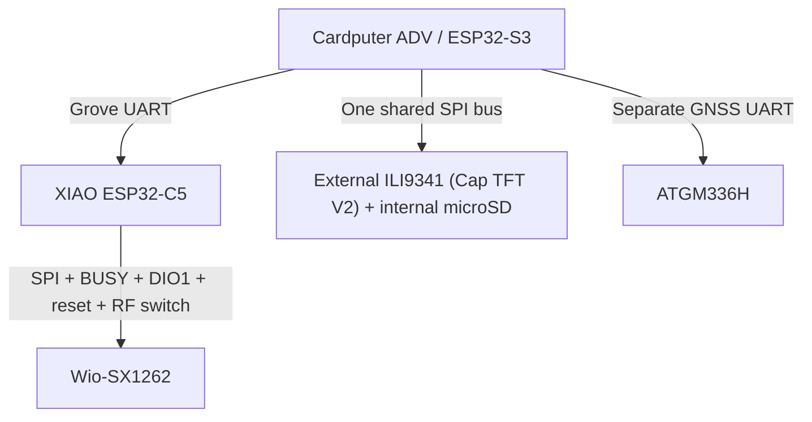

# Cardputer ADV backpack — hardware and pin handoff

**Revision:** D — Markdown coding-agent handoff  
**Date:** 2026-09-12  
**Status:** Signal assignments selected; electrical bench validation pending  
**Scope:** Component ownership, physical connections, firmware pin configuration, and electrical constraints.

This document supersedes the original architecture draft and PDF revisions A–C for pin assignments. Use the tables and configuration below as the implementation baseline. Custom firmware has not yet been implemented or tested against this hardware.

## 1. Actual components and ownership

| Component | Role | Connected to |
|---|---|---|
| M5Stack Cardputer ADV, ESP32-S3 | Host, keyboard, internal display, external display, GNSS parsing, SD logging | All host peripherals and Grove UART |
| Seeed Studio XIAO ESP32-C5 | Radio coprocessor: Wi-Fi, BLE, IEEE 802.15.4, LoRa control | Cardputer through UART; Wio through SPI and GPIO |
| Seeed Wio-SX1262 for XIAO | SX1262 LoRa transceiver; standard two-row header version, SKU 113010003 | XIAO through a custom wire harness |
| MakerWorld "Cap TFT V2" display expansion: 2.8-inch SPI ILI9341 TFT, 240 × 320, 8-pin, no touch, with onboard step-down regulator | External display | Cardputer rear EXT header |
| Onboard step-down regulator on the Cap TFT V2 board, identified by the user as AMS1117-3.3 (confirm marking/datasheet on bench) | Steps Cardputer 5 V OUT down to regulated 3.3 V for the display | Cap TFT V2 board; VIN from EXT6, VOUT feeds display VCC + BLK |
| Standard five-pin ATGM336H GNSS breakout shown in the supplied photo | Position/time receiver; VCC, GND, TX, RX, PPS header | Cardputer rear EXT header |
| Existing internal microSD | Host storage | Existing Cardputer wiring; shares SPI signals with external TFT |

**The XIAO and Wio are separately wired. Do not assume a stacked shield pinout.** The Wio board has no separately programmed application MCU; the C5 configures and operates the SX1262 over SPI. The TFT and GNSS are also peripherals, not additional application firmware targets.

The Cardputer owns GNSS directly. GNSS data need not traverse the C5 link unless a specific radio feature needs location information.



## 2. Pin notation and implementation rules

- `GPIO` numbers are native ESP32 pin numbers. Firmware constants below use these numbers, not XIAO `D` labels or connector positions.
- `EXT` numbers are physical positions on the Cardputer ADV rear 14-pin connector, following M5Stack's documentation.
- TFT pin numbers follow the Cap TFT V2's **8-pin** header (§5). Match printed labels when wiring; front and rear views are mirrored.
- Wio endpoint names are its own silkscreen labels. **XIAO D0 → Wio RST**, not Wio D0.
- GPIO numbering is local to each processor. S3 GPIO1 and C5 GPIO1 are different electrical nets.
- All interconnected digital signals use **3.3 V logic**. A connector carrying 5 V power does not make its signal pins 5 V tolerant.
- `null` in the configuration means no MCU GPIO is allocated. Do not silently assign a default pin to these functions.
- Preserve the Cardputer ADV board support configuration for existing keyboard, display, IMU, audio, USB, and SD hardware.

## 3. Cardputer ↔ XIAO UART

| Net | Cardputer Grove endpoint | XIAO endpoint | Direction |
|---|---|---|---|
| HOST_TO_C5 | Yellow / S3 GPIO2, configured TX | D7 / C5 GPIO12, configured RX | Cardputer → C5 |
| C5_TO_HOST | White / S3 GPIO1, configured RX | D6 / C5 GPIO11, configured TX | C5 → Cardputer |
| GND | Black / GND | GND | Common reference |
| Optional backpack power | Red / selectable 5 V rail | XIAO 5V pad through qualified protection | Disconnected in initial USB-powered prototype |

Initial transport: **115200 baud, 8N1**, no RTS/CTS. Use one S3 hardware UART for this link and a different one for GNSS. The UART controller indices should be chosen around the actual application and board libraries; the physical RX/TX assignments above are fixed.

Use the C5 UART0 pins shown, with native USB for separate development logs. C5 ROM startup text may appear on GPIO11, so the host must recover framing after boot noise. Keep application debug text out of the command channel.

Optional prototype series resistors: **470 Ω in each TX line**, near its transmitter. These are not level shifters or complete powered-off isolation. Keep the initial cable short, preferably under 15 cm.

## 4. XIAO ↔ Wio-SX1262 custom harness

### 4.1 Complete connections

| Net | XIAO label | C5 GPIO | Wio silkscreen | Direction at C5 |
|---|---|---:|---|---|
| Radio supply | 3V3 output | — | 3V3 | Power output |
| Ground | GND | — | GND | Common reference |
| LORA_SCK | D8 | 8 | SCK | Output |
| LORA_MISO | D9 | 9 | MISO | Input |
| LORA_MOSI | D10 | 10 | MOSI | Output |
| LORA_NSS | D4 | 23 | NSS | Output, active low |
| LORA_RESET | D0 | 1 | RST | Output, active low |
| LORA_DIO1 | D1 | 0 | DIO1 | Interrupt input |
| LORA_BUSY | D5 | 24 | BUSY | Input, high means busy |
| LORA_RF_SW | D2 | 25 | RF_SW | Output |

Leave **Wio VIN, D0, D6, and D7 unconnected**. Leave **XIAO D3 / GPIO7 unconnected**. XIAO D6/D7 are occupied by the host UART. XIAO D4/D5 are occupied by LoRa and are not spare I2C pins.

This differs from direct stacking. Do not combine this harness with electrical connections through stacked headers.

### 4.2 Proposed startup resistors and decoupling

| Part | Connection | Purpose |
|---|---|---|
| 10 kΩ pull-up | Wio NSS → Wio 3V3 | Deselect radio while MCU resets |
| 10 kΩ pull-up | Wio RST → Wio 3V3 | Define released reset before software reset pulse |
| 10 kΩ pull-down | Wio RF_SW → GND | Define startup RF-control state |
| 100 nF ceramic | Wio 3V3 → GND, near header | Local high-frequency bypass |
| 10 µF | Wio 3V3 → GND, near header | Local supply support |

These are proposed external additions; account for existing board pulls and decoupling during assembly. Power Wio from XIAO 3V3 as shown rather than introducing an independently switched radio supply.

### 4.3 Radio-specific initialization requirements

- **BUSY is required**, not optional. Use bounded waits according to the SX1262 command sequence; report a fault rather than hanging forever.
- DIO1 is the host interrupt line. Keep interrupt handling short and defer SPI work to the radio task.
- Configure NSS high before SPI traffic. Apply the documented SX1262 reset sequence before initialization.
- GPIO25 is a strapping pin for **SDIO clock-edge selection**, not normal SPI-flash boot selection. This design does not use SDIO. The proposed RF_SW pull-down defines its sampled level. Still test cold boots and native USB recovery with the radio attached.
- The Wio has RF-switch and TCXO requirements beyond generic SX1262 SPI wiring. Do not use an arbitrary bare-SX1262 board preset.
- Seeed's RF-switch clarification identifies external RF_SW as `/CTRL`, with internal DIO2 as `CTRL`. The intended operating states are:

| Radio state | C5 GPIO25 / Wio RF_SW | Internal SX1262 DIO2 |
|---|---|---|
| Receive | High | Low |
| Transmit | Low | High |

Configure radio DIO2 RF-switch operation and the host RF_SW transitions coherently. The external GPIO is not automatically managed by enabling DIO2 alone. Set the appropriate path before the corresponding RX/TX command; validate transitions during bring-up.

The Wio module uses internal **DIO3 to power its TCXO**. No additional DIO3 host wire is needed. Its documented TCXO range permits 1.8 V at a 3.3 V supply; use the correct library/SDK voltage encoding and the documented oscillator startup delay. Do not guess delay values. Use the module's **DC-DC regulator mode**.

The Wio module is specified for **862–930 MHz**. It is not the 433 MHz version suggested as a generic option in the original draft. Select operating frequency and TX settings deliberately for the antenna and application; do not start transmitting automatically on boot.

Start SPI near **1 MHz** with leads under approximately 10 cm and adjacent ground returns. Increase speed after checking reliable transactions.

## 5. Cardputer ↔ Cap TFT V2 display (8-pin SPI, onboard step-down)

**Withdrawn:** the earlier "ordered 11-pin TFT" assumption below (its CLK/MOSI/RES/DC/BLK/MISO/CS1/CS2/PEN 11-pin header, the touch CS pull-up, and the separately-wired peripheral supply). The board actually selected is MakerWorld's "Cap TFT V2" display expansion: a 2.8-inch ILI9341, 240 × 320, **8-pin, no touch**, mounted on a cap PCB with its own onboard step-down regulator. It was transcribed from the MakerWorld listing on 2026-09-13; confirm against the physical board before soldering, same as every other component here.

The confirmed display header is:

`1 GND, 2 VCC, 3 SCL, 4 SDA, 5 RES, 6 DC, 7 CS, 8 BLK`.

`SCL`/`SDA` are this panel's silkscreen names for SPI clock and MOSI — there is **no I²C bus and no MISO pin** on this board; it is write-only by construction, not just by firmware choice.

### 5.1 Complete header disposition

| TFT pin | Label | Connect to | Baseline behavior |
|---:|---|---|---|
| 1 | GND | Cap step-down module GND / Cardputer EXT 4 / GND | Common ground |
| 2 | VCC | Cap step-down module VOUT | Regulated 3.3 V from the onboard regulator, not a bare Cardputer rail |
| 3 | SCL | Cardputer EXT 7 / S3 GPIO40 | SPI SCK, shared with internal SD |
| 4 | SDA | Cardputer EXT 9 / S3 GPIO14 | SPI MOSI, shared with internal SD |
| 5 | RES | Cardputer EXT 1 / S3 GPIO3 | LCD reset, active low. **GPIO3 is an S3 JTAG strap pin (§7) — this diverges from the earlier assumption that avoided it. Bench-verify cold boot and JTAG both still work with this line driven before calling this ready.** |
| 6 | DC | Cardputer EXT 5 / S3 GPIO6 | Low = command; high = data |
| 7 | CS | Cardputer EXT 13 / S3 GPIO5 | LCD chip-select, active low |
| 8 | BLK | Cap step-down module VOUT | Backlight is tied directly to the regulated 3.3 V rail alongside VCC. It is **not** MCU-driven — there is no backlight PWM/enable GPIO on this board, confirming §9's open question. |

GPIO4 (Cardputer EXT 3) is **not used** by this display — the earlier draft assigned it to DC, which this board does not. It is free for reassignment (GNSS or otherwise) during firmware bring-up. GPIO39/EXT11 (MISO) also stays unconnected, consistent with the write-only design.

### Cap step-down module

| Regulator net | Connect to | Notes |
|---|---|---|
| VIN | Cardputer EXT 6 / 5V OUT | Input from the Cardputer's switched 5 V rail |
| VOUT | Display pin 2 (VCC) and pin 8 (BLK) | Regulated 3.3 V; powers panel logic and backlight together, no separate switch |
| GND | Cardputer EXT 4 / GND, display pin 1 | Common reference |

This is the "final regulator" §9 previously left unselected for TFT/GNSS supply — it ships on the display cap itself rather than as a separately wired part. It does **not** power the GNSS receiver; GNSS still needs its own supply per §6.

### 5.2 Shared SPI bus with internal SD

| SPI net | S3 GPIO | Devices |
|---|---:|---|
| SCK | 40 | Internal SD and external TFT |
| MOSI | 14 | Internal SD and external TFT |
| MISO | 39 | Internal SD; external TFT pin 8 left open |
| SD CS | 12 | Existing internal SD only |
| TFT CS | 5 | External TFT only |

The external TFT does **not** receive a separate dedicated S3 SPI bus. It uses the existing SD bus, with a different chip-select. LoRa is on the C5's separate SPI bus and cannot contend electrically with this bus.

Firmware requirements:

1. Keep the TFT and unused touch controller deselected during startup.
2. Initialize the SD card into SPI mode before other traffic on this shared bus when a card is present.
3. Reuse the existing SD SPI bus object/controller. Inspect the board library before choosing a framework-specific SPI host identifier; do not initialize a second independent bus on these same pins.
4. Coordinate SD and TFT transactions with one shared bus lock/transaction mechanism. Separate UI/storage tasks must not bypass it.
5. Set each device's clock/mode for its transaction; start external TFT transfers around 4 MHz.
6. Configure the TFT as write-only. Do not require display ID/readback operations through its disconnected MISO pin.
7. Preserve the existing internal display's pins and bus configuration. It is a separate display from the external ILI9341.

If touch is added later, allocate a real touch CS GPIO, connect external MISO only after verifying deselected output behavior, and include touch in shared-bus arbitration. Polling could avoid a PEN GPIO, but touch is not part of the current pin assignment.

## 6. Cardputer ↔ ATGM336H GNSS

Use the standard five-pin module shown by the user. Match its printed labels rather than a different six-pin GNSS breakout diagram.

This GNSS wiring shares the same physical 14-pin rear EXT connector as the Cap TFT V2 display (§5). The display cap's own wiring leaves GPIO13/GPIO15 (EXT12/14) untouched, so the assignment below is unaffected by the display's presence on the same header. GPIO4 (EXT3) is also unused by the display and is available if GNSS needs a different pin during firmware bring-up — per §2, GPIO-to-function assignment is a firmware decision; only the EXT-position-to-GPIO mapping is fixed by the Cardputer board itself. How the display and GNSS physically share or stack on one 14-pin socket is an assembly detail still to be worked out, not a pin-numbering one.

| GNSS label | Connection | Direction / purpose |
|---|---|---|
| VCC | Qualified regulated supply; 3.3 V is the intended candidate | Receiver power; see §9 |
| GND | Cardputer EXT 4 / GND | Common reference |
| TX | Cardputer EXT 14 / S3 GPIO15 | GNSS output → host UART RX |
| RX | Cardputer EXT 12 / S3 GPIO13 | Host UART TX → GNSS input; optional configuration wire |
| PPS | Unconnected | No PPS GPIO allocated |

Begin with **9600 baud, 8N1, NMEA reception**, the documented -5N family default. An already configured unit may differ, so make baud configurable. Use a hardware UART distinct from the C5 link.

Firmware should parse NMEA locally, retain fix validity and age, and tolerate the absence of a fix. No fix is different from no UART data. Do not require PPS to obtain basic position or time messages. Do not assume the ATGM receiver accepts u-blox UBX configuration commands.

A compatible antenna connects to the GNSS RF socket. Active/passive type and antenna bias remain physical assembly details; firmware cannot supply missing RF bias through TX/RX.

## 7. Complete Cardputer rear-header allocation

| EXT pin | Board net | Assignment |
|---:|---|---|
| 1 | GPIO3 | TFT RES (Cap TFT V2). **S3 JTAG strap pin** — bench-verify cold boot and JTAG both still work with this line driven before calling this ready. |
| 2 | 5VIN | Unconnected in this baseline; do not bridge to 5VOUT |
| 3 | GPIO4 | Unused by the Cap TFT V2 display; free for reassignment during firmware bring-up |
| 4 | GND | TFT/GNSS ground |
| 5 | GPIO6 | TFT DC (Cap TFT V2) |
| 6 | 5VOUT | Feeds the Cap TFT V2's onboard step-down regulator (VIN); its regulated 3.3 V output powers the display VCC + BLK only, and is not otherwise exposed on this connector |
| 7 | GPIO40 | Shared SD/TFT SCK |
| 8 | GPIO8 | Reserved internal I2C SDA |
| 9 | GPIO14 | Shared SD/TFT MOSI |
| 10 | GPIO9 | Reserved internal I2C SCL |
| 11 | GPIO39 | Existing SD MISO; no external connection in baseline |
| 12 | GPIO13 | GNSS UART TX from host |
| 13 | GPIO5 | TFT CS |
| 14 | GPIO15 | GNSS UART RX at host |

Do not repurpose GPIO8/GPIO9: they serve existing Cardputer ADV I2C peripherals. Header labels suggesting RESET/INT/BUSY do not override the actual GPIO assignments here.

## 8. Canonical firmware configuration

This YAML is a framework-neutral hardware contract embedded in Markdown. Translate it into the project's board configuration; do not interpret `null` as GPIO0. Optional controller identifiers are deliberately left to integration with the existing board support libraries.

```yaml
hardware_revision: cardputer_adv_c5_wio_rev_d
pin_numbering: native_gpio_per_processor

cardputer_adv:
  mcu: esp32_s3
  coprocessor_uart:
    tx_gpio: 2
    rx_gpio: 1
    baud: 115200
    format: 8N1
    hardware_flow_control: false
  gnss_uart:
    tx_gpio: 13
    rx_gpio: 15
    baud: 9600
    format: 8N1
    receiver: atgm336h
    initial_protocol: nmea
    pps_gpio: null
  shared_sd_tft_spi:
    sck_gpio: 40
    mosi_gpio: 14
    miso_gpio: 39
    sd_cs_gpio: 12
    initialize_sd_before_tft_traffic: true
    shared_transaction_lock_required: true
  external_tft:
    controller: ili9341
    display_module: cap_tft_v2   # MakerWorld cap, 8-pin, no touch, onboard step-down
    native_width: 240
    native_height: 320
    cs_gpio: 5
    dc_gpio: 6
    reset_gpio: 3   # S3 JTAG strap pin — bench-verify boot/JTAG before field use
    initial_spi_hz: 4000000
    readback_enabled: false
    backlight_gpio: null   # BLK is hard-wired to the step-down VOUT, not MCU-driven; no PWM possible
    touch_enabled: false   # board has no touch pins at all, not just disabled in software
    touch_cs_gpio: null
    touch_irq_gpio: null
    touch_cs_external_pullup_ohms: null
    supply_and_backlight_circuit_verified: false   # regulator identified as AMS1117-3.3; confirm on bench
  preserve_existing_internal_peripherals: true

xiao_esp32_c5:
  host_uart:
    tx_gpio: 11
    rx_gpio: 12
    baud: 115200
    format: 8N1
    hardware_flow_control: false
  lora:
    board: wio_sx1262_for_xiao_header_version
    connection: separate_custom_harness
    sck_gpio: 8
    miso_gpio: 9
    mosi_gpio: 10
    nss_gpio: 23
    reset_gpio: 1
    dio1_gpio: 0
    busy_gpio: 24
    rf_switch_gpio: 25
    initial_spi_hz: 1000000
    regulator_mode: dc_dc
    tcxo_control: internal_dio3
    tcxo_voltage_candidate_v: 1.8
    tcxo_startup_delay_us: null # Resolve from module/oscillator documentation.
    dio2_rf_switch_control_required: true
    external_rf_switch_rx_level: 1
    external_rf_switch_tx_level: 0
    transmit_on_boot: false
    operating_frequency_hz: null # Explicit application/antenna setting required.
  status_led:
    gpio: 27
    active_level: 0          # active-low; bench-confirmed 2026-09-12
    color: yellow
    strapping_pin: true      # sampled at reset only; board circuit sets the level
    source: seeed_xiao_esp32c5_wiki_pin_map_user_led
  unused_main_header_gpio: 7
```

### 8.1 Status LED (added 2026-09-12)

The XIAO's onboard yellow user LED is on **C5 GPIO27** (Seeed XIAO ESP32-C5 wiki, pin map: `USER_LED | GPIO27`). It is not on the main header and does not collide with any allocation above.

- **GPIO27 is a strapping pin** (ESP-IDF GPIO reference for ESP32-C5: GPIO2, 7, 25, 27, 28). Its level is sampled only at reset and is set by the board's own LED circuit, which Seeed designed to boot correctly. Firmware drives it only after boot. As with GPIO25, test cold boots and USB recovery.
- **Active-low**: per Seeed's example code, and confirmed on the delivered board on 2026-09-12 (short flashes with dark in between, not the inverted pattern).
- The red charge LED is driven by the charger IC, not by software.

## 9. Electrical power and assembly notes

These notes describe assembly limits; they do not block coding the selected signal map.

### Initial development arrangement

- Power the Cardputer from its normal USB/battery arrangement.
- Power the XIAO from its own USB-C. Leave Grove red disconnected and insulated, and leave XIAO 5V/BAT pads unused.
- Supply Wio from XIAO 3V3, with common ground.
- The TFT's supply is resolved: the Cap TFT V2 board carries its own step-down regulator (identified by the user as AMS1117-3.3; confirm the marking/datasheet on the bench), fed from Cardputer 5V OUT (EXT6) and regulating to 3.3 V for the display VCC + BLK (§5). This is a fixed part of the purchased/printed board, not a separately wired component to design.
- GNSS still needs its own qualified peripheral supply; the display's onboard regulator does not power it. The GNSS receiver itself is specified at **2.7–3.6 V**. Calling the breakout “standard” establishes its connector convention, not proof of a 5 V regulator. Use 3.3 V if its VCC directly feeds the receiver; verify regulator requirements if one intervenes.
- BLK is confirmed as a direct LED path tied to the step-down VOUT, not a transistor/driver enable. No backlight GPIO is assigned or needed; software must not drive an arbitrary pin for brightness.

### Power sequencing

Both endpoints must be powered before connecting active signal lines. Disconnect UART signals before powering only one MCU; the Cardputer Grove pull-ups can also inject current into an unpowered C5. Apply the same principle to independently powered TFT/GNSS peripherals. Series resistors alone do not provide complete isolation.

Later Grove-powered operation requires measured current capacity and reviewed USB/Grove isolation for the delivered XIAO revision. The Cardputer Grove supply is selectable between 5VIN and 5VOUT in the published schematic. Do not bridge EXT 5VIN and 5VOUT or parallel regulator outputs.

### Current budget to verify

| Item | Planning information |
|---|---|
| XIAO 3.3 V path | Published regulator is labeled 1 A total; this includes the C5 and external loads |
| C5 board allowance | Provisional 550 mA at 3.3 V; measure actual peaks |
| Wio | About 125 mA typical at +22 dBm TX; use a provisional 150 mA allowance |
| C5 + Wio | 700 mA example; adding 30% margin gives 910 mA, close to the nominal 1 A path |
| GNSS | About 25 mA at 3.3 V for the -5N module; breakout/antenna loads are additional |
| Ordered TFT | Full-backlight current is unmeasured; no validated value from the previous display example applies |

Calculate input current as `Vout × Iout / (Vin × efficiency)` and add other loads separately. Do not add currents measured at different voltages directly. Measure at the module pins under simultaneous activity before approving battery operation.

## 10. Firmware integration and bring-up

The coding agent should implement board configuration and small component tests before the full application:

1. **UART:** configure both ends, exchange bounded test messages, tolerate C5 boot text, and detect peer reset/disconnection.
2. **LoRa:** configure GPIO defaults, reset the radio, verify BUSY transitions and SPI responses, then validate RF-switch/TCXO setup and receive operation. Use explicit frequency settings and a matching antenna before any TX test.
3. **TFT:** initialize ILI9341 using the write-only pin map. Do not make unsupported display-readback or backlight-PWM assumptions.
4. **SD + TFT:** integrate both into the same SPI bus/locking mechanism. Test cold startup with SD inserted and sustained redraw while writing and reading back a disposable test file.
5. **GNSS:** receive raw NMEA, parse valid messages, distinguish a no-fix state from UART failure, and verify outdoor reception.
6. **Combined:** exercise UI, storage, GNSS, host UART, and radios together. Measure supply dips and record resets, timeouts, serial overruns, and storage errors.
7. **Recovery:** repeat cold starts and independent MCU resets while both remain powered. Verify native USB flashing/recovery without changing the wiring.

Keep radio failures local to the C5 where possible. The Cardputer must remain usable if the backpack is absent. Do not perform slow SPI operations inside DIO1 interrupt context. Separate tasks still require shared-bus coordination on the S3.

The original draft proposed newline-delimited JSON at 115200 baud for the interprocessor application protocol. That remains a possible first implementation, not a requirement imposed by electrical wiring. Whichever framing is selected, use bounded messages/queues and re-synchronize after boot or reset.

C5 Wi-Fi, BLE, and IEEE 802.15.4 share RF resources through time division. They are not three continuously independent receivers. The separate LoRa chip can operate alongside them subject to power and interference testing. Account for the Cardputer's own wireless transmitter if enabled.

## 11. Sources and evidence

The pin plan combines manufacturer references with the user's exact connector images. It is a reviewed assignment, not evidence of a physically tested assembly.

- [M5Stack Cardputer ADV documentation](https://docs.m5stack.com/en/core/Cardputer-Adv): Grove, EXT header, and internal peripheral pin maps.
- [M5Stack Cardputer ADV schematic v1.0](https://m5stack-doc.oss-cn-shenzhen.aliyuncs.com/1178/Sch_M5CardputerAdv_v1.0_2025_06_20_17_19_58.pdf): shared SD nets, Grove pull-ups, and power selector.
- [Seeed XIAO ESP32-C5 documentation](https://wiki.seeedstudio.com/xiao_esp32c5_getting_started/): D-label/GPIO mappings.
- [Seeed XIAO ESP32-C5 schematic](https://files.seeedstudio.com/wiki/XIAO_ESP32C5/res/Seeed_Studio_XIAO_ESP32C5.pdf): power circuitry; match delivered board revision.
- [Espressif ESP32-C5 datasheet](https://www.espressif.com/sites/default/files/documentation/esp32-c5_datasheet_en.pdf): GPIO25 strap function, radio current, and coexistence.
- [Seeed Wio-SX1262 for XIAO](https://www.seeedstudio.com/Wio-SX1262-for-XIAO-p-6379.html): standard header-version identity and manufacturer underside photo. Do not substitute the ESP32-S3 B2B kit map.
- [Seeed Wio-SX1262 module datasheet](https://files.seeedstudio.com/products/SenseCAP/Wio_SX1262/Wio-SX1262_Module_Datasheet.pdf): supply, RF band, DIO2/DIO3, and module requirements.
- [Seeed engineering RF-switch clarification](https://forum.seeedstudio.com/t/wio-sx1262-refsw-dio2-and-no-actual-schematic-for-the-module/294808/10): RF_SW to `/CTRL`, internal DIO2 to `CTRL`.
- [Espressif SD SPI bus sharing guidance](https://docs.espressif.com/projects/esp-idf/en/stable/esp32s3/api-reference/peripherals/sdspi_share.html): card startup and shared-bus constraints.
- [ATGM336H-5N manufacturer specifications](https://www.icofchina.com/daohang/danpin/2525.html): receiver supply and default serial output.
- User-supplied `IMG_1723.png`: five-pin ATGM336H breakout, labels VCC/GND/TX/RX/PPS.
- User-supplied `IMG_1724.jpeg` and subsequent `image.png`: an earlier candidate blue 11-pin ILI9341 touch display. **Superseded** by the Cap TFT V2 board actually selected; kept here only as a record of what §5 previously assumed.
- [MakerWorld "Cap TFT V2 — Display Expansion for Cardputer ADV"](https://makerworld.com/en/models/3235288-cap-tft-v2-display-expansion-for-cardputer-adv): the display and step-down module actually selected. The page itself is Cloudflare-protected and could not be fetched directly; its pinout tables and board photo were transcribed by the user on 2026-09-13 and are reproduced in §5. Re-verify against the live page or purchased board if this doc and the physical board ever disagree.

## 12. Changes from the original draft

- Selected actual Wio-SX1262, ILI9341 11-pin TFT, and ATGM336H components.
- Fixed both ends of the host and GNSS UART connections.
- Made SX1262 BUSY mandatory and added Wio RF_SW control.
- Moved LoRa CS to C5 GPIO23 and BUSY to GPIO24; C5 GPIO7 remains unused.
- Specified a separate Wio harness, not stacked default connections.
- Corrected external TFT SPI to share the existing internal SD bus.
- Reserved internal Cardputer I2C pins and removed assumed spare C5 I2C pins.
- Disabled touch/PPS/backlight PWM unless a later pin-plan revision explicitly adds them.
- Removed the nonmatching 14-pin TFT power and jumper example.
- Preserved supply verification as a physical assembly task without leaving the coding agent's signal assignments ambiguous.
