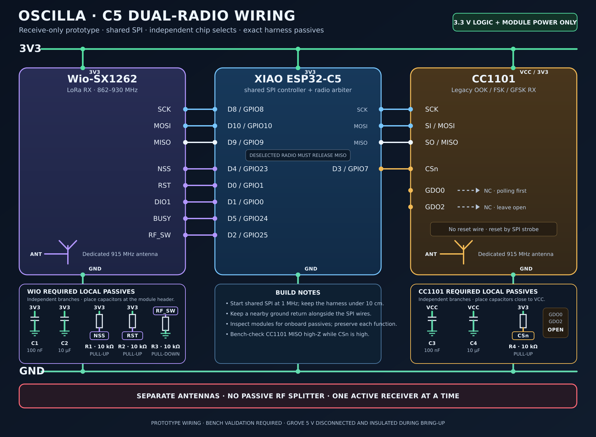

# C5 dual-radio backpack — wiring handoff

[](c5-dual-radio-wiring.svg)

**Revision:** E-CC1101 addendum  
**Date:** 2026-09-19
**Status:** Proposed wiring; electrical and RF bench validation pending  
**Scope:** Adds a TI CC1101 as a second, receive-only sub-GHz peripheral to the existing Cardputer ADV + XIAO ESP32-C5 + Wio-SX1262 backpack.

This document is the authority for the **CC1101 addition** and its C5 shared-SPI integration. It does not replace the Cardputer, TFT, GNSS, Grove-UART, or Wio-SX1262 requirements in [`Research/c5-backpack-design.md`](../../Research/c5-backpack-design.md) Rev D. Where this addendum conflicts with Rev D, this addendum wins only for the C5 dual-radio changes enumerated below.

> **Receive-only invariant:** Neither radio gets a transmit command, feature flag, or reachable driver TX path. The CC1101 is added for passive legacy OOK/FSK/GFSK observation; it is not a LoRa replacement.

## 1. Design intent and boundaries

| Radio | Intended receive role | Not a role |
|---|---|---|
| Wio-SX1262 | 862–930 MHz LoRa observation, including compatible 915 MHz LoRa traffic; future (G)FSK capability may be evaluated separately | General-purpose spectrum analyzer |
| CC1101 | Legacy narrowband OOK/FSK/GFSK observation in the 433 MHz ISM band (387–464 MHz per the E07-M1101D-SMA module) | LoRa, Meshtastic, or LoRaWAN decoder |

Frequency alone does not identify a protocol. A 915 MHz LoRa waveform remains an SX1262 job; the CC1101 cannot demodulate LoRa chirp spread spectrum. Conversely, the CC1101 does not provide wideband raw-IQ or a true waterfall. Each radio tunes and observes one configured narrowband channel at a time.

The C5 may electrically operate both radios, but **Oscilla v1 schedules only one sub-GHz receive engine at a time**. The two modules sit close together on one harness, so this prevents them from desensitizing one another regardless of band overlap, and keeps the receive-only command surface small.

## 2. C5 pin allocation

The first three SPI wires are a shared bus. Each radio has an independent active-low chip select. All signal levels are 3.3 V.

| Function | XIAO label | C5 GPIO | Wio-SX1262 endpoint | CC1101 endpoint | Notes |
|---|---|---:|---|---|---|
| Shared SPI clock | D8 | 8 | SCK | SCK | Keep both modules close; begin at 1 MHz. |
| Shared controller-out data | D10 | 10 | MOSI | SI / MOSI | C5 output. |
| Shared controller-in data | D9 | 9 | MISO | SO / MISO/GDO1 | Keep CC1101 `IOCFG1.GDO1_CFG=0x2E` (three-state) so it releases MISO while CSn is high; bench-check the actual module. |
| Wio chip select | D4 | 23 | NSS | — | Active low; existing 10 kΩ pull-up remains required. |
| **CC1101 chip select** | **D3** | **7** | — | **CSn** | **New allocation.** Add a 10 kΩ pull-up to 3V3. |
| Wio reset | D0 | 1 | RST | — | Do not share this signal. |
| Wio interrupt | D1 | 0 | DIO1 | — | Do not tie this to either CC1101 GDO pin. |
| Wio BUSY | D5 | 24 | BUSY | — | Required for Wio command sequencing. |
| Wio RF switch | D2 | 25 | RF_SW | — | Existing strap-sensitive connection; retain Rev D pull-down and boot testing. |
| CC1101 GDO0 | — | — | — | GDO0 | Leave unconnected in the first harness; firmware polls CC1101 status/FIFO. |
| CC1101 GDO2 | — | — | — | GDO2 | Leave unconnected in the first harness. |

CC1101 has no dedicated reset wire in this design. Use TI's bounded manual
power-on reset sequence: set SCK high and SI low, strobe CSn low then high,
wait at least 40 µs, pull CSn low, wait for SO to go low, issue `SRES`, then
wait for SO to go low again. Do not reuse Wio reset, DIO1, BUSY, or RF_SW for
CC1101 signals.

GPIO7 is the ESP32-C5 JTAG signal-source strap, not a boot-mode strap. It has
no internal pull. With the default JTAG eFuses, its sampled level is a
don't-care and USB Serial/JTAG remains selected; if
`EFUSE_JTAG_SEL_ENABLE=1` while both JTAG interfaces remain enabled, high
selects USB Serial/JTAG and low selects the pad-JTAG pins. The required 10 kΩ
CSn pull-up therefore defines a safe,
deselected peripheral state and does not change the default boot mode. Record
the delivered board's eFuse state and retain cold-boot, native-USB, and JTAG
recovery tests with the pull-up fitted.

## 3. Wio-SX1262 harness passives

The CC1101 extension does **not** replace the Wio boot, RF-switch, or supply-conditioning network from Rev D. Keep these parts with the Wio custom harness.

| Part | Connection | Purpose |
|---|---|---|
| 10 kΩ pull-up | Wio NSS → Wio 3V3 | Keeps the Wio deselected while the C5 resets or is unpowered. |
| 10 kΩ pull-up | Wio RST → Wio 3V3 | Holds reset released until the C5 deliberately pulses reset. |
| 10 kΩ pull-down | Wio RF_SW → GND | Defines the external RF-control state during startup; retain cold-boot and USB-recovery testing because GPIO25 is strap-sensitive. |
| 100 nF ceramic | Wio 3V3 → GND, physically near the Wio header | Local high-frequency supply bypass. |
| 10 µF ceramic/electrolytic | Wio 3V3 → GND, near the Wio header | Local transient support. |

Inspect the delivered Wio board before adding external parts. Retain the required electrical function without blindly duplicating components that are already fitted on the module. The Wio still requires its separate C5 connections for RST, DIO1, BUSY, and RF_SW; do not reduce it to a four-wire SPI peripheral.

## 4. CC1101 harness and required passives

### 4.1 Point-to-point connections

| CC1101 module label | Connect to | Direction / requirement |
|---|---|---|
| VCC / 3V3 | XIAO 3V3 output | **3.3 V only.** Do not use a 5 V module supply. |
| GND | XIAO GND | Common reference; run a ground alongside the SPI wires. |
| SCK | XIAO D8 / GPIO8 | Shared SPI clock. |
| SI / MOSI | XIAO D10 / GPIO10 | C5 → CC1101 data. Confirm module silkscreen; some boards call this `MOSI`. |
| SO / MISO/GDO1 | XIAO D9 / GPIO9 | CC1101 → C5 data. Leave `IOCFG1.GDO1_CFG=0x2E`; any other GDO1 function may drive this shared line while `CSn` is high. |
| CSN / CS | XIAO D3 / GPIO7 | New, dedicated active-low chip select. |
| GDO0 | No connection initially | Optional future packet/event interrupt after a real spare-GPIO plan exists. |
| GDO2 | No connection initially | Optional; leave open. |
| ANT | Dedicated antenna matched to the module's configured band | Use a 433 MHz antenna for 387–464 MHz work (E07-M1101D-SMA band). |

### 4.2 Add these components

| Part | Connection | Purpose |
|---|---|---|
| 10 kΩ pull-up | CC1101 CSn → 3V3 | Keeps the CC1101 deselected while the C5 resets or is unpowered. |
| 100 nF ceramic | CC1101 VCC → GND, physically near module header | Local high-frequency supply bypass. |
| 10 µF ceramic/electrolytic | CC1101 VCC → GND, near module header | Local transient support. |
| 433 MHz antenna | CC1101 ANT connector/pad | Band-match the antenna; do not use a 915 MHz antenna for 433 MHz measurements. |

The pull-up and decoupling parts are required even if a breakout board appears to include similar parts; inspect the delivered board and avoid accidentally placing conflicting values. Do **not** add series resistors, a shared-antenna splitter, or a GPIO expander in the first build unless bench measurements show a specific need.

### 4.3 RF layout rules

- Use **separate antennas** for the Wio and CC1101. Do not combine their antenna ports with a passive T/splitter.
- Keep antenna feed lines and radio modules away from the C5, display, and USB wiring where practical.
- Keep the shared SPI harness short (target under 10 cm), with a nearby ground return. Start at 1 MHz; raise the clock only after reliable transfers are measured.
- The Wio (862–930 MHz) and CC1101 (387–464 MHz) now target separate bands by design, so this addendum no longer relies on the earlier same-band desense assumption. That does not remove the need to measure coexistence (line pickup, harmonics, supply-rail interaction); the v1 arbiter still intentionally leaves the inactive radio idle regardless.

## 5. Safe electrical and firmware operation

### 5.1 Boot state

1. Keep **Wio NSS** and **CC1101 CSn** high with their external pull-ups before the C5 configures GPIO.
2. Configure C5 GPIO8/9/10 as the shared SPI bus, then drive both chip selects high.
3. Initialize the Wio only through its Rev D reset, BUSY, TCXO, DIO2/RF-switch sequence.
4. Initialize the CC1101 with the bounded manual power-on reset sequence above, then read `PARTNUM`/`VERSION` and perform a register write/read-back while Wio NSS stays high.
5. On any timeout, deselect the affected radio, surface a local hardware fault, and keep the deck UI running.

### 5.2 Bus and radio arbitration

The C5 firmware needs two separate responsibilities:

```text
shared SPI bus lock
  └─ radio arbiter (one active sub-GHz engine)
       ├─ lora_rx: select Wio NSS; SX1262 receive driver
       └─ legacy_rx: select CC1101 CSn; CC1101 receive/polling driver
```

- The SPI lock protects every transaction; no interrupt handler performs SPI work.
- A transition to `lora_rx` first stops and deselects the CC1101; a transition to `legacy_rx` first stops and deselects the Wio.
- The two drivers have independent register maps and timing. Never send an SX1262 command to CC1101 or assume a shared register configuration.
- `legacy_rx` begins with polling, not a GDO interrupt. A future interrupt-driven revision needs a new C5 pin allocation; never wire GDO0 and Wio DIO1 together.
- Keep `IOCFG1.GDO1_CFG=0x2E` in every CC1101 profile. Changing it makes the shared SO/MISO pin a generic output whenever CSn is high and can create bus contention.
- The only exposed behaviors remain receive, stop, status, and fault reporting. There is no transmit mode.

## 6. Power and validation gates

The existing Rev D planning budget already places C5 + Wio near the published 3.3 V rail allowance. CC1101 receive current is small compared with the Wio transmit planning figure, but it is still an additional load. **Do not approve a shared battery/Grove-power arrangement on calculation alone.**

Keep the prototype arrangement unchanged during initial bring-up:

- Cardputer and XIAO powered from separate USB connections.
- Grove red 5 V conductor disconnected and insulated.
- Wio and CC1101 powered from the XIAO 3V3 rail only after continuity inspection.

Before calling this extension ready, record:

1. Continuity: no short from 3V3 to GND; no CSn cross-connection.
2. Boot: both CS lines remain high through C5 reset and native-USB recovery.
3. SPI: SX1262 `GetStatus` and CC1101 `PARTNUM`/`VERSION` plus register write/read-back succeed while the other CS stays high.
4. MISO isolation: with CC1101 CSn high and `IOCFG1.GDO1_CFG=0x2E`, Wio reads remain correct and a logic-analyzer/scope trace shows no contention. Constant `0x00`/`0xFF` is only a symptom to investigate, not proof of which device is at fault.
5. Receive: Wio receives a known compatible LoRa transmission; CC1101 detects/receives only a known compatible OOK/FSK/GFSK test source. Record frequency, modulation, deviation, data rate, bandwidth, sync/packet settings, source, distance, and antenna.
6. Coexistence: measure false events, loss rate, and supply current during repeated transitions between radio modes.
7. Power: measure 3.3 V rail voltage and current at the module pins under the intended worst combined system load.

Mark every result as measured, failed, or untested. Do not represent this wiring as field-ready before these gates pass.

## 7. Sources

- Existing backpack baseline: [`Research/c5-backpack-design.md`](../../Research/c5-backpack-design.md) Rev D.
- [Espressif ESP32-C5 datasheet](https://documentation.espressif.com/esp32-c5_datasheet_en.pdf): GPIO7 JTAG strap behavior and default eFuse state.
- [Seeed XIAO ESP32-C5 pin map](https://wiki.seeedstudio.com/xiao_esp32c5_getting_started/): XIAO D-label to native-GPIO mapping.
- [TI CC1101 datasheet](https://www.ti.com/lit/ds/symlink/cc1101.pdf): SPI interface, reset strobe, supported modulation families, and RF-band constraints.
- [CDEBYTE E07-M1101D-SMA product page](https://www.cdebyte.com/products/E07-M1101D-SMA/2): the specific CC1101 module this addendum targets. 387–464 MHz band, 1.8–3.6 V supply, SMA antenna connector. Confirms the SPI pinout (GND, VCC, GDO0, CSN, SCK, MOSI, MISO/GDO1 shared, GDO2) assumed above.
- [Seeed Wio-SX1262 module datasheet](https://files.seeedstudio.com/products/SenseCAP/Wio_SX1262/Wio-SX1262_Module_Datasheet.pdf): Wio supply, RF-switch, TCXO, and module constraints.
